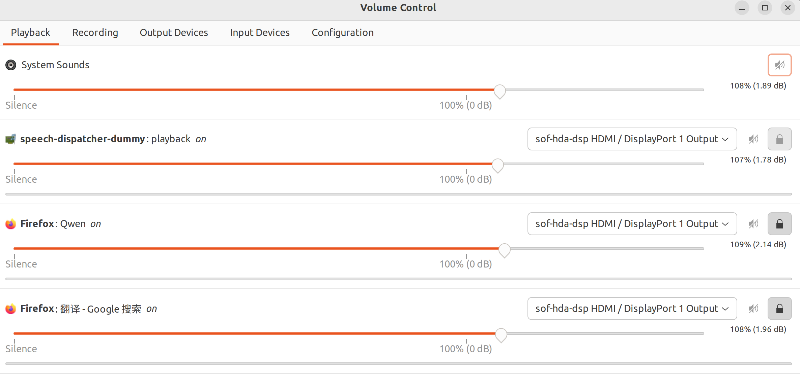
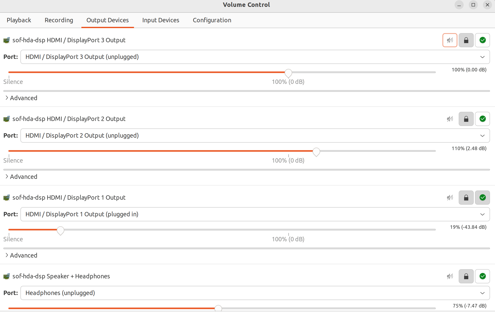

## Ubuntu系统的一些常见修改及配置

### 目录

[背景](#背景)  
[更换系统源](#更换系统apt源)  
[用户管理](#ubuntu用户管理)
[系统时间](#ubuntu系统内置时间)
[restart相关](#设置系统restart等待时间)
[]

### 背景

如遇到重装Ubuntu系统，可能会有一些之前的配置忘记，故在此使用笔记的形式记录

### 更换系统apt源

使用清华源：https://mirrors.tuna.tsinghua.edu.cn/help/ubuntu/

将下面的内容(清华源)替换<strong>/etc/apt/sources.list</strong>

**注意：要先执行下面指令备份原始的源后再替换.**

```shell
sudo cp /etc/apt/sources.list /etc/apt/sources.list.old 
```

```vim
# 默认注释了源码镜像以提高 apt update 速度，如有需要可自行取消注释
deb https://mirrors.tuna.tsinghua.edu.cn/ubuntu/ jammy main restricted universe multiverse
# deb-src https://mirrors.tuna.tsinghua.edu.cn/ubuntu/ jammy main restricted universe multiverse
deb https://mirrors.tuna.tsinghua.edu.cn/ubuntu/ jammy-updates main restricted universe multiverse
# deb-src https://mirrors.tuna.tsinghua.edu.cn/ubuntu/ jammy-updates main restricted universe multiverse
deb https://mirrors.tuna.tsinghua.edu.cn/ubuntu/ jammy-backports main restricted universe multiverse
# deb-src https://mirrors.tuna.tsinghua.edu.cn/ubuntu/ jammy-backports main restricted universe multiverse

# 以下安全更新软件源包含了官方源与镜像站配置，如有需要可自行修改注释切换
deb http://security.ubuntu.com/ubuntu/ jammy-security main restricted universe multiverse
# deb-src http://security.ubuntu.com/ubuntu/ jammy-security main restricted universe multiverse

# 预发布软件源，不建议启用
# deb https://mirrors.tuna.tsinghua.edu.cn/ubuntu/ jammy-proposed main restricted universe multiverse
# # deb-src https://mirrors.tuna.tsinghua.edu.cn/ubuntu/ jammy-proposed main restricted universe multiverse
```

### Ubuntu用户管理

- 新建用户
  ```shell
  sudo useradd -m <username> # -m 同时初始化家目录
  ```
  设置密码
  ```shell
  sudo passwd <username>
  ```
  验证用户信息
  ```shell
  id <username>
  grep <username> /etc/passwd
  ```
  切换用户
  ```shell
  su cjj # 输入密码即可
  # 如果Authentication failure
  sudo su cjj
  ```

- 添加sudo权限
  ```shell
  sudo usermod -aG sudo cjj
  ```

- 改变用户默认SHELL
  ```shell
  chsh # 如果这个没用
  sudo chsh -s /bin/bash cjj
  ```

- 查看全部用户信息
  ```shell
  sudo vim /etc/passwd
  ```

- 查看用户组信息
  ```shell
  vim /etc/group
  ```

### 设置系统restart等待时间

Ubuntu restart默认时间是**1min30s**，有时候我们需要频繁切换系统，这会给我们带来不必要的时间消耗，我们可以执行下面的操作来修改默认的重启等待时间.

```shell
cd /etc/systemd
sudo vim system.conf
```


然后打开注释这两行的注释并修改时间即可.

**补充**
- 经实验，仅有修改为0s时才会立刻重启，否则都是采用1min30s等待
- 建议不要使用立刻重启，可能会对系统造成损伤.~~血的教训，没关掉firefox立刻重启，firefox卡了几次~~


### Ubuntu系统内置时间

有时候发现切换系统后Ubuntu的Auto time set不起作用，换一个wifi即可解决.

### Ubuntu系统声音

前提：系统的settings无法有效解决问题.

当发现自己ubuntu的外放或者耳机没有声音了，应该先去检查output_devices是否正确，需要安装pavucontrol去查看

```shell
sudo apt install pavucontrol 
```

打开pavucontrol如下




可以查看每个应用的输出设备，同时可以去输出设备里拖动声音，查看哪个是系统的默认扬声器，这里的Headphones为外放的扬声器，其他的port可能是不同的连线耳机的输出插口.找到自己的外放口或者可以输出声音的口后，为应用设置对应的输出设备即可.
