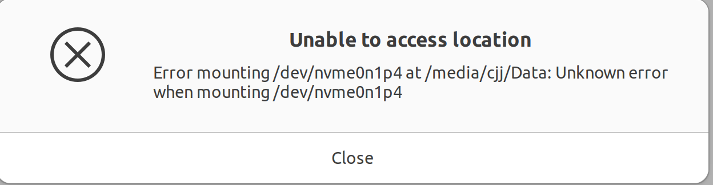
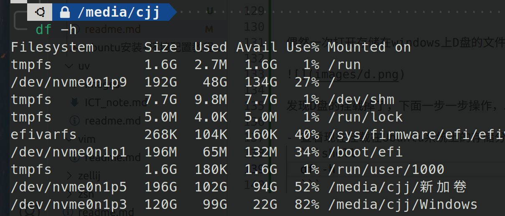
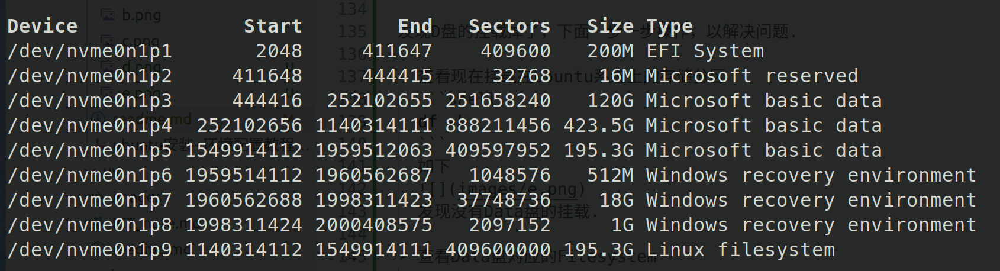

# Ubuntu系统的一些常见修改及配置

## 目录

[背景](#背景)  
[更换系统源](#更换系统apt源)    
[用户管理](#ubuntu用户管理)  
[系统时间](#ubuntu系统内置时间)  
[restart相关](#设置系统restart等待时间)  
[系统声音](#ubuntu系统声音)  
[磁盘挂载](#磁盘挂载)  
[磁盘空间管理](#磁盘空间管理)  

## 背景

如遇到重装Ubuntu系统，可能会有一些之前的配置忘记，故在此使用笔记的形式记录

## 更换系统apt源

使用清华源：https://mirrors.tuna.tsinghua.edu.cn/help/ubuntu/

将下面的内容(清华源)替换<strong>/etc/apt/sources.list</strong>

**注意：要先执行下面指令备份原始的源后再替换.**

```shell
sudo cp /etc/apt/sources.list /etc/apt/sources.list.old 
```

```vim
# 默认注释了源码镜像以提高 apt update 速度，如有需要可自行取消注释
deb https://mirrors.tuna.tsinghua.edu.cn/ubuntu/ jammy main restricted universe multiverse
# deb-src https://mirrors.tuna.tsinghua.edu.cn/ubuntu/ jammy main restricted universe multiverse
deb https://mirrors.tuna.tsinghua.edu.cn/ubuntu/ jammy-updates main restricted universe multiverse
# deb-src https://mirrors.tuna.tsinghua.edu.cn/ubuntu/ jammy-updates main restricted universe multiverse
deb https://mirrors.tuna.tsinghua.edu.cn/ubuntu/ jammy-backports main restricted universe multiverse
# deb-src https://mirrors.tuna.tsinghua.edu.cn/ubuntu/ jammy-backports main restricted universe multiverse

# 以下安全更新软件源包含了官方源与镜像站配置，如有需要可自行修改注释切换
deb http://security.ubuntu.com/ubuntu/ jammy-security main restricted universe multiverse
# deb-src http://security.ubuntu.com/ubuntu/ jammy-security main restricted universe multiverse

# 预发布软件源，不建议启用
# deb https://mirrors.tuna.tsinghua.edu.cn/ubuntu/ jammy-proposed main restricted universe multiverse
# # deb-src https://mirrors.tuna.tsinghua.edu.cn/ubuntu/ jammy-proposed main restricted universe multiverse
```

## Ubuntu用户管理

- 新建用户
  ```shell
  sudo useradd -m <username> # -m 同时初始化家目录
  ```
  设置密码
  ```shell
  sudo passwd <username>
  ```
  验证用户信息
  ```shell
  id <username>
  grep <username> /etc/passwd
  ```
  切换用户
  ```shell
  su cjj # 输入密码即可
  # 如果Authentication failure
  sudo su cjj
  ```

- 添加sudo权限
  ```shell
  sudo usermod -aG sudo cjj
  ```

- 改变用户默认SHELL
  ```shell
  chsh # 如果这个没用
  sudo chsh -s /bin/bash cjj
  ```

- 查看全部用户信息
  ```shell
  sudo vim /etc/passwd
  ```

- 查看用户组信息
  ```shell
  vim /etc/group
  ```

## 设置系统restart等待时间

Ubuntu restart默认时间是**1min30s**，有时候我们需要频繁切换系统，这会给我们带来不必要的时间消耗，我们可以执行下面的操作来修改默认的重启等待时间.

```shell
cd /etc/systemd
sudo vim system.conf
```


然后打开注释这两行的注释并修改时间即可.

**补充**
- 经实验，仅有修改为0s时才会立刻重启，否则都是采用1min30s等待
- 建议不要使用立刻重启，可能会对系统造成损伤.~~血的教训，没关掉firefox立刻重启，firefox卡了几次~~


## Ubuntu系统内置时间

有时候发现切换系统后Ubuntu的Auto time set不起作用，换一个wifi即可解决.

## Ubuntu系统声音

前提：系统的settings无法有效解决问题.

当发现自己ubuntu的外放或者耳机没有声音了，应该先去检查output_devices是否正确，需要安装pavucontrol去查看

```shell
sudo apt install pavucontrol 
```

打开pavucontrol如下


可以查看每个应用的输出设备，同时可以去输出设备里拖动声音，查看哪个是系统的默认扬声器，这里的Headphones为外放的扬声器，其他的port可能是不同的连线耳机的输出插口.找到自己的外放口或者可以输出声音的口后，为应用设置对应的输出设备即可.

## 磁盘挂载


偶然一次打开存储在windows上D盘的文件，然后整个系统卡死了，强重启后，出现下面的现象



发现D盘的挂载掉了，下面一步一步操作，以解决问题.

- 查看现在挂载在Ubuntu系统上的存储分区
  ```shell
  df -h 
  ```
  如下
  
  发现没有Data盘的挂载.

- 查看Data盘对应的Filesystem
  ```shell
  sudo fdisk -l
  ```
  

  这是系统硬件方面列出的主要存储分区，找到Data盘对应的device.

- 重新挂载
  ```shell
  sudo mkdir -p /media/cjj/Data # 先创建文件区
  sudo mount /dev/nvme0n1p4 /media/cjj/Data 
  ```

  如果出现下面的错误
  ```shell
  $MFTMirr does not match $MFT (record 3).
  Failed to mount '/dev/nvme0n1p4': Input/output error
  NTFS is either inconsistent, or there is a hardware fault, or it's a
  SoftRAID/FakeRAID hardware. In the first case run chkdsk /f on Windows
  then reboot into Windows twice. The usage of the /f parameter is very
  important! If the device is a SoftRAID/FakeRAID then first activate
  it and mount a different device under the /dev/mapper/ directory, (e.g.
  /dev/mapper/nvidia_eahaabcc1). Please see the 'dmraid' documentation
  for more details.
  ```

  说明Data盘可能损坏了，尝试修复.
  ```shell
  sudo ntfsfix /dev/nvme0n1p4 # 尝试修复 NTFS
  ```
  出现下面信息即可.
  ```shell
  Mounting volume... $MFTMirr does not match $MFT (record 3).
  FAILED
  Attempting to correct errors... 
  Processing $MFT and $MFTMirr...
  Reading $MFT... OK
  Reading $MFTMirr... OK
  Comparing $MFTMirr to $MFT... FAILED
  Correcting differences in $MFTMirr record 3...OK
  Processing of $MFT and $MFTMirr completed successfully.
  Setting required flags on partition... OK
  Going to empty the journal ($LogFile)... OK
  Checking the alternate boot sector... OK
  NTFS volume version is 3.1.
  NTFS partition /dev/nvme0n1p4 was processed successfully.
  ```

  再次挂载即可.
  ```shell
  sudo mount /dev/nvme0n1p4 /media/cjj/Data 
  ```

  **如果仍有问题，去windows系统检查并备份重要文件!!!**

## 磁盘空间管理

- 查看某文件夹的磁盘占用
  ```shell
  du -sh    # 查看当前文件夹每个文件的磁盘占用
  du -sh .  # 查看当前文件夹下的磁盘占用
  du -sh file/folder # 查看当前文件下的某个文件或文件夹的磁盘占用
  ```

- 按磁盘占用大小排序输出
  ```shell
  du -h --max-depth=1 | sort -h
  ```

- 磁盘优化建议
  通常<b> \~/.cache、~/.vscoder-server</b>等文件夹占用大量的磁盘空间，可将其移动到存储盘，具体做法详见[软链接的使用](../ln/readme.md)的实际应用部分.