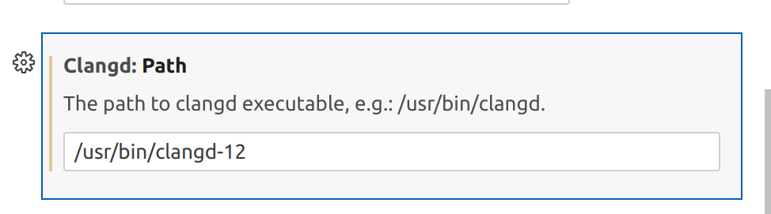
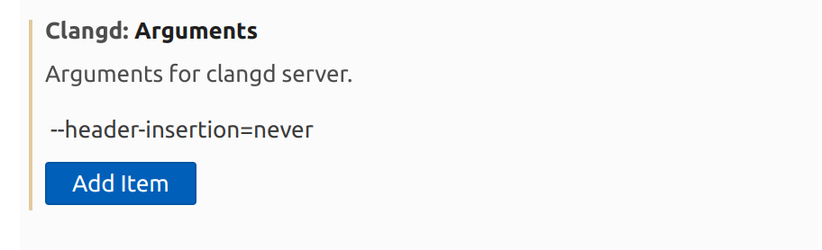
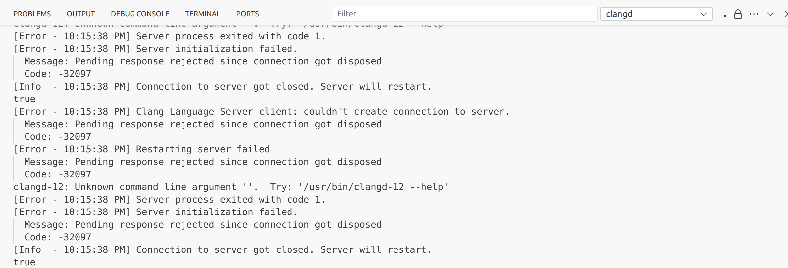
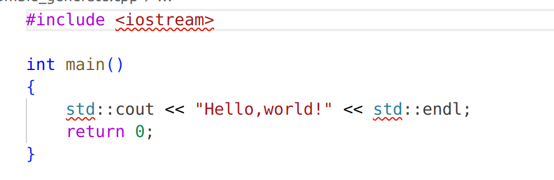

# clangd : vscode中更好用的自动补全

clangd官网 : https://clangd.llvm.org/

## 目录

[clangd安装](#clangd安装)  
[clangd基于cmake-project的使用](#clangd基于cmake-project的使用)  
[clangd基于ros2-colcon build的使用](#ros2的工程项目colcon-build使用clangd)  
[clangd基于make-project的使用](#clangd基于make-project的使用)  
[vscode中clangd插件问题](#vscode-clangd问题)  

## clangd安装

- 本地软件包安装
    ```shell
    sudo apt-get install clangd-12
    find /usr -iname "*clangd*" # iname     "*name*" 通配查找clangd的位置
    ```

- vscode中插件安装clangd插件
    安装完成后，进入插件的setting，修改两处地方
    1、
    2、这里的arguments是根据自己喜欢的设置，我这个<strong>--header-insertion=nerver</strong>是关闭头文件自动补全.
    
    

## clangd基于cmake-project的使用

- CMakeLists.txt编译产生(在CMakeLists.txt前加入)
    ```cmake
    # 为clangd产生配置文件
    set(CMAKE_EXPORT_COMPILE_COMMANDS ON)
    ```
- cmake命令行指令生成
    ```shell
    cmake -DCMAKE_EXPORT_COMPILE_COMMANDS=ON
    ```
经过上面的操作，会在我们的工程目录的build文件夹或其他目录下生成一个**compile_commands.json文件**，其内容如下

```json
[
{
  "directory": "/home/cjj/my_temp/temp/build",
  "command": "/usr/bin/c++ -DIE_THREAD=IE_THREAD_TBB -DOV_THREAD=OV_THREAD_TBB -DTBB_PREVIEW_WAITING_FOR_WORKERS=1 -isystem /usr/include/opencv4 -isystem /opt/intel/openvino/runtime/include -isystem /opt/intel/openvino/runtime/include/ie -Wno-error=deprecated-declarations -o CMakeFiles/main.dir/src/main.cpp.o -c /home/cjj/my_temp/temp/src/main.cpp",
  "file": "/home/cjj/my_temp/temp/src/main.cpp"
}
]
```

指定了头文件的搜索路径，那么我们就可以在写代码时享受快速且精准的代码补全了，让我们和warning与errors说goodbye！

## ROS2的工程项目colcon build使用clangd

直接在命令行使用指令

```shell
cb --cmake-args -DCMAKE_EXPORT_COMPILE_COMMANDS=ON
```

## clangd基于make-project的使用

对于使用makefile的项目，需要使用bear执行下面的指令来生成.json的编译数据库文件.

```shell
bear -- make
```

### bear的安装

bear官网：https://github.com/rizsotto/Bear

Bear is packaged for many distributions. Check out your package manager. Or build it from source.

而Linux已经有bear的软件包，直接执行下面的指令

```shell
sudo apt-get install bear
```

## vscode-clangd问题

### 失效

失效表现为没有代码提示，如头文件不可跳转,如下


排查做法：查看vscode的output即可查看报错，根据报错去找到具体的原因即可.



### 标准库找不到

当编译完c语言内核代码后，我发现clangd插件找不到c++的标准库了，如下



解决方法：

先找到库头文件的位置
```shell
g++ -v -E -x c++ - < /dev/null 2>&1 | grep -i " /usr/include"
```

输出可能如下
```shell
 /usr/include/c++/11
 /usr/include/x86_64-linux-gnu/c++/11
 /usr/include/c++/11/backward
 /usr/include/x86_64-linux-gnu
 /usr/include
```

找到缺失的手动添加到clangd产生的compile_commands.json文件，以/usr/include/x86_64-linux-gnu/c++/11为例子，添加后的compile_commands.json文件如下

```json
[
{
  "directory": "/home/cjj/Desktop/my_project/OS_Concept/第3章/编程作业/3.18/build",
  "command": "/usr/bin/c++   -std=gnu++17 -o CMakeFiles/main.dir/zombie_generate.cpp.o -c /home/cjj/Desktop/my_project/OS_Concept/第3章/编程作业/3.18/zombie_generate.cpp -isystem /usr/include/c++/11 -isystem /usr/include/x86_64-linux-gnu/c++/11",
  "file": "/home/cjj/Desktop/my_project/OS_Concept/第3章/编程作业/3.18/zombie_generate.cpp"
}
]
```

其中-isystem /usr/include/x86_64-linux-gnu/c++/11是关键
