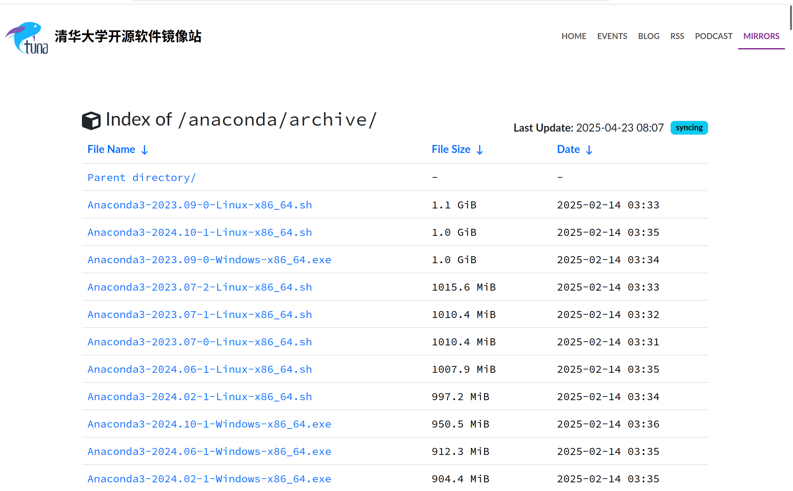
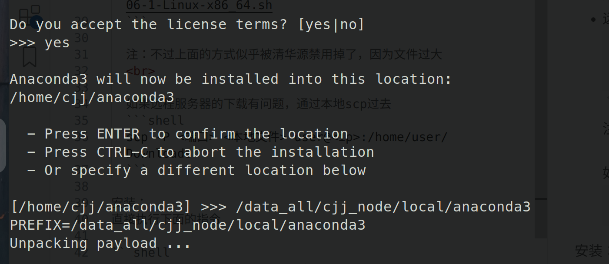
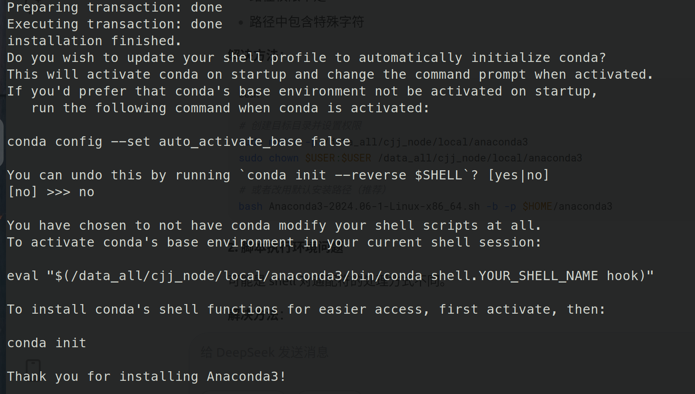
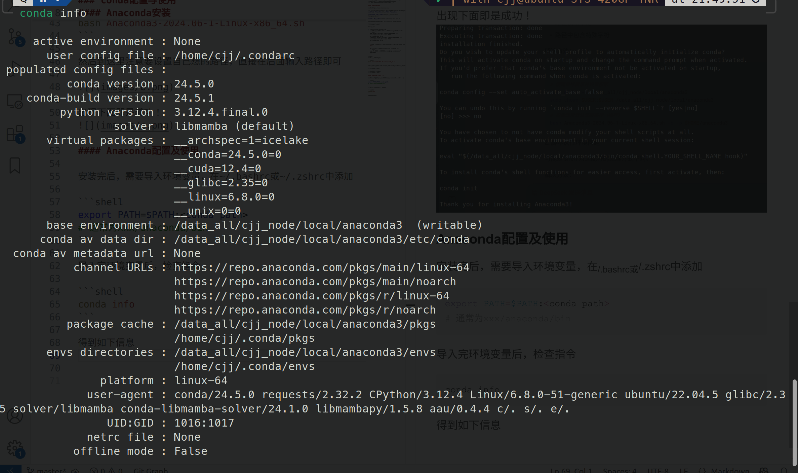
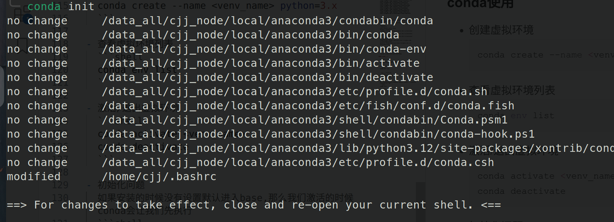
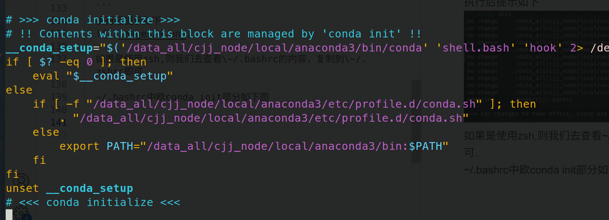

# Anaconda配置与使用

## 目录

[背景](#背景)  
[conda安装](#anaconda安装)   
[conda配置](#conda配置与使用)    
[conda使用](#conda使用)  

## 背景

conda是一类python包管理器，可以创建不同的虚拟环境以满足不同需求，现在流行的有Miniconda、Anaconda等
我们这里介绍Anaconda的安装、配置与使用

## Anaconda安装

官网：https://www.anaconda.com/

由于官网的安装非常的不人性化，要各种登陆认证，下面推荐**清华大学的开源镜像站**或者**北外开源镜像站**

**清华大学开源镜像站**：https://mirrors.tuna.tsinghua.edu.cn

**北外开源镜像站**：https://mirrors.bfsu.edu.cn

下载最新的体积最大(不一定，看个人设备条件)的即可



下载方式：

- 本地：直接点击下载到本地
- 远程服务器：右键获取下载连接，通过wget或者curl下载
  ```shell
  wget https://mirrors.tuna.tsinghua.edu.cn/anaconda/archive/Anaconda3-2024.06-1-Linux-x86_64.sh
  # 或者curl https://mirrors.tuna.tsinghua.edu.cn/anaconda/archive/Anaconda3-2024.06-1-Linux-x86_64.sh
  ```

  注：不过上面的方式似乎被清华源禁用掉了，因为文件过大
  <br>

  如果远程服务器的下载有问题，通过本地scp过去
  ```shell
  scp -P <端口> <本地文件> user@<ip>:/home/user/Downloads
  ```

安装：
直接执行下面的指令

```shell
bash Anaconda3-2024.06-1-Linux-x86_64.sh
```

然后到这里注意要设置自己想的路径，直接在后面输入路径即可



出现下面即是成功！


## Anaconda配置

- 安装完后，需要导入环境变量，在~/.bashrc或~/.zshrc中添加

    ```shell
    export PATH=$PATH:<conda path>
    # 通常为xxx/anaconda/bin
    ```

- 导入完环境变量后，检查指令

    ```shell
    conda info
    ```

    得到如下信息
    

    在这个信息中可以看到它的默认源即其他信息

- 切换默认源
  ~~法一：直接命令行执行(已弃用)~~
  ```shell
  conda config --add channels https://mirrors.tuna.tsinghua.edu.cn/anaconda/pkgs/free/
  conda config --add channels https://mirrors.tuna.tsinghua.edu.cn/anaconda/pkgs/main
  conda config --add channels https://mirrors.tuna.tsinghua.edu.cn/anaconda/pkgs/r
  conda config --add channels https://mirrors.tuna.tsinghua.edu.cn/anaconda/pkgs/msys2
  conda config --add channels https://mirrors.tuna.tsinghua.edu.cn/anaconda/cloud/conda-forge
  conda config --add channels https://mirrors.tuna.tsinghua.edu.cn/anaconda/cloud/msys2 
  conda config --add channels https://mirrors.tuna.tsinghua.edu.cn/anaconda/cloud/bioconda
  conda config --add channels https://mirrors.tuna.tsinghua.edu.cn/anaconda/cloud/menpo
  conda config --add channels https://mirrors.tuna.tsinghua.edu.cn/anaconda/cloud/pytorch
  conda config --add channels https://mirrors.tuna.tsinghua.edu.cn/anaconda/cloud/simpleitk

  ```

  法二：设置配置文件
  conda info查看得到**user config file : /home/user/.condarc**  
  那么打开.condarc，加入以下字段(参考清华镜像)
  ```vim
  channels:
  - defaults
  show_channel_urls: true
  default_channels:
  - https://mirrors.tuna.tsinghua.edu.cn/anaconda/pkgs/main
  - https://mirrors.tuna.tsinghua.edu.cn/anaconda/pkgs/r
  - https://mirrors.tuna.tsinghua.edu.cn/anaconda/pkgs/msys2
  custom_channels:
  conda-forge: https://mirrors.tuna.tsinghua.edu.cn/anaconda/cloud
  pytorch: https://mirrors.tuna.tsinghua.edu.cn/anaconda/cloud
  ```
  然后清除以下缓存
  ```shell
  conda clean -i
  ```

  再次运行conda info即可发现源变了

## conda使用

- 创建虚拟环境
  ```shell
  conda create --name <venv_name> python=3.x
  ```

- 删除虚拟环境
  ```shell
  conda env remove --name <venv_name>
  # conda remove --name <venv_name> -all
  ```

- 查看虚拟环境列表
  ```shell
  conda env list
  ```

- 激活/退出虚拟环境
  ```shell
  conda activate <venv_name>
  conda deactivate
  ```

- 初始化问题
  如果安装的时候没有设置默认进入base,那么我们激活的时候conda会让我们先执行
  ```shell
  conda init
  ```
  执行后提示如下
  

  如果是使用zsh,则我们去查看\~/.bashrc的内容，复制到\~/.zshrc即可.

  ~/.bashrc中欧conda init部分如下图

  
 

## 注意事项

- conda换的源是使用下面的指令才有效的
  ```shell
  conda install
  ```
  如果需要使用conda虚拟环境下的pip指令安装，则需要类似下面的指令(**以清华源的pip源为例**)
  ```shell
  conda activate <your-env>
  pip install <package_name> -i https://mirrors.tuna.tsinghua.edu.cn/pypi/web/simple
  ```
  永久配置的方式不太推荐!!!

## 后记

不足或者错误的地方，欢迎提出！
