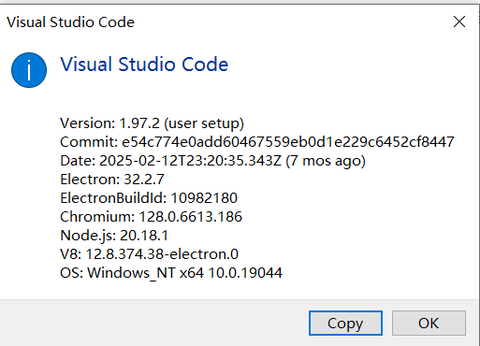
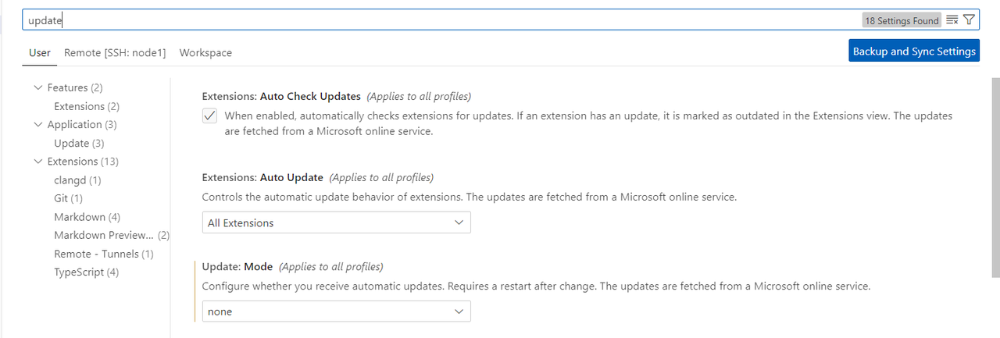

# Vscode 远程连接进入docker容器——代码提示、跳转，更好的代码阅读体验

## 前言

**这是我在momenta实习过程的笔记，使用公司的电脑，为windows系统**；由于新版的vscode无法兼容老式服务器的配置，ubuntu 20以下的服务器或者docker容器均无法连接，需要将vscode降版本，做法如下：

**测试成功的版本:**

  

为vscode 1.97.2
下载地址：https://update.code.visualstudio.com/1.97.2/win32-x64-user/stable
这个版本的vscode可以远程进入obf_em的docker容器(即ubuntu16.04)

---

## 坑点

**一、自动更新**

每次下载完旧版本的vscode后，重新打开，在help about里查看版本的时候，却发现又变成新的版本了，所以我们需要关闭vscode的自动更新，操作如下

- 打开vscode，进入settings
- 搜索update，并将mode设置为none，如下

  

**如果在执行这一步骤的时候，vscode已经自动更新为最新版本，请重新安装旧版本!**

**温馨提示**：如果上述操作都没生效，可能是vscode的缓存配置问题，可以尝试删除C:\Users\xxx\AppData\Roaming目录下的Code文件夹后重新安装，(**注意，这样会清除你个人的vscode的个性化配置，如字体，主题等，需要及时备份**)

<br>

**二、ubuntu16.04的docker容器里没有clangd怎么办？**

这里的做法不固定，我的做法是vscode连接docker容器后，安装了clangd插件，自动跳出是否安装clangd提示，点击安装即可.

我的版本如下
```shell
 # 位于/root/.vscode-server/data/User/globalStorage/llvm-vs-code-extensions.vscode-clangd/install/21.1.0/clangd_21.1.0/bin 下
 
 ./clangd --version                                                                                                                                                                  
clangd version 21.1.0 (https://github.com/llvm/llvm-project 3623fe661ae35c6c80ac221f14d85be76aa870f1)                                                                                      
Features: linux+grpc                                                                                                                                                                       
Platform: x86_64-unknown-linux-gnu
```


如果没有跳出安装clangd提示，请自行查阅资料，可进行源码编译安装  
官网仓库：https://github.com/llvm/llvm-project

<br>

**三、代码提示、跳转不生效**

clangd是基于compile_commands.json,即编译信息来补全的，重新在docker容器中编译一次obf_em项目即可.

**最终效果:**
可以快乐地进行代码提示、跳转啦！
没有一堆报错，简洁、快速的跳转！

<br>

## 参考

- 降低版本：https://zhuanlan.zhihu.com/p/1906879551230944324
- 关闭自动更新：https://blog.csdn.net/mighty13/article/details/114419378