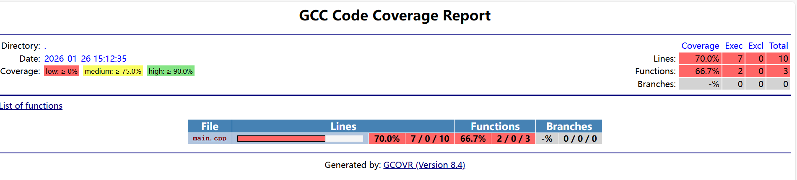
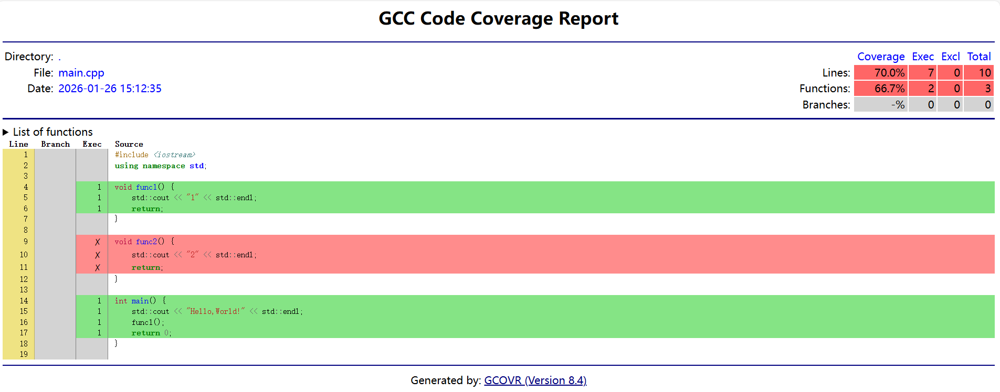

# python包——gcovr使用

## 目录

[背景](#背景)  
[安装](#安装)  
[使用](#使用)  
[参考](#参考)  

## 背景

Gcovr 提供了一个用于管理 GNU gcov 工具使用并生成汇总代码覆盖率结果的实用程序。

<br>

## 安装

```shell
pip install gcovr
```

<br>

## 使用

### 基本使用

- 以下面的demo源码为例子
    ```cpp
    #include <iostream>
    using namespace std;

    void func1() {
        std::cout << "1" << std::endl;
        return;
    }

    void func2() {
        std::cout << "2" << std::endl;
        return;
    }

    int main() {
        std::cout << "Hello,World!" << std::endl;
        func1();
        return 0;
    }
    ```

- 编译
    ```shell
    g++ -fprofile-arcs -ftest-coverage -O0 -g main.cpp -o main
    # 其中 -fprofile-arcs -ftest-coverage是gcovr的核心编译指令，-O0是为了防止编译器优化，导致统计覆盖率出问题
    ```

- 执行程序
    ```shell
    ./main
    ```
    会在当前目录下生成<strong>.gcda文件</strong>，表示对程序执行一次测试

- 绘制覆盖信息
    ```shell
    gcovr -r .
    ```

- 生成html可视化结果
    ```shell
    gcovr -r . --html --html-details -o your_dir/example-html-details.html
    ```

效果如下：
  
  

### 进阶使用

- 基本过滤使用

  ```shell
  # 只分析src目录
  gcovr --filter 'src/' -r .
  
  # 排除测试文件
  gcovr --exclude 'test/' -r .
  
  # 排除构建目录和第三方代码
  gcovr --exclude-directories 'build/' --exclude 'third_party/' -r .
  ```

- 使用配置文件
  创建一个配置文件，如下内容
  ```config
  filter = STL/
  exclude = test/

  html = yes
  html-details = yes
  html-title = CJJ_STL 覆盖率报告
  output = tmp/coverage_report.html
  ```

  执行时指定
  ```shell
  gcovr -r . --config your_dir/xxxx.cfg
  ```

  如果root下存在gcovr.cfg，gcovr会默认读取

- 具体案例
  [CJJ_STL](https://github.com/cuijunjie18/CJJ_STL.git)  

<br>

## 参考

简单使用：https://www.cnblogs.com/KID-XiaoYuan/p/13266700.html  
官方说明：https://gcovr.com/en/stable/index.html

