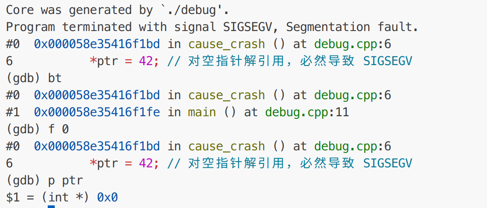

# GDB调试工具使用

## 配置

### gdb dashboard安装

由于原始 GDB 命令行过于简陋，为方便调试，我们需要下载 gdb-dashboard 插件

参考官网安装教程：https://github.com/cyrus-and/gdb-dashboard

启用语法高亮，需要安装pygments的python包
```shell
pip install --no-cache-dir pygments
```

**注意如果不生效，执行下面的命令**
```shell
grep -qxF 'set auto-load safe-path /' ~/.gdbinit || echo 'set auto-load safe-path /' >> ~/.gdbinit # 使gdb可以信任所有目录的.gdbinit
```

## 具体案例

### 调试core dump

core dump是程序崩溃前保存的**快照**，用于调试.

- 查看是否会生成core文件
  ```shell
  ulimit -c # 输出0则不会
  ```

- 设置生成core文件
  ```shell
  ulimit -c unlimited
  sudo sh -c "echo './core' > /proc/sys/kernel/core_pattern"  # 修改默认生成位置
  ```
  如果不修改默认生成位置，使用下面的指令查看当前core文件的生成位置
  ```shell
  cat /proc/sys/kernel/core_pattern
  ```

- 调试core文件
  ```shell
  gdb ./program <core_file>
  # bt查看函数调用栈、f <n>跳转到对应的函数栈
  ```
  具体效果如下(一个空指针错误例子)
    


## 参考

调试core dump： https://zhuanlan.zhihu.com/p/1894779801983767813  
简单使用： https://blog.csdn.net/weixin_45031801/article/details/134399664  