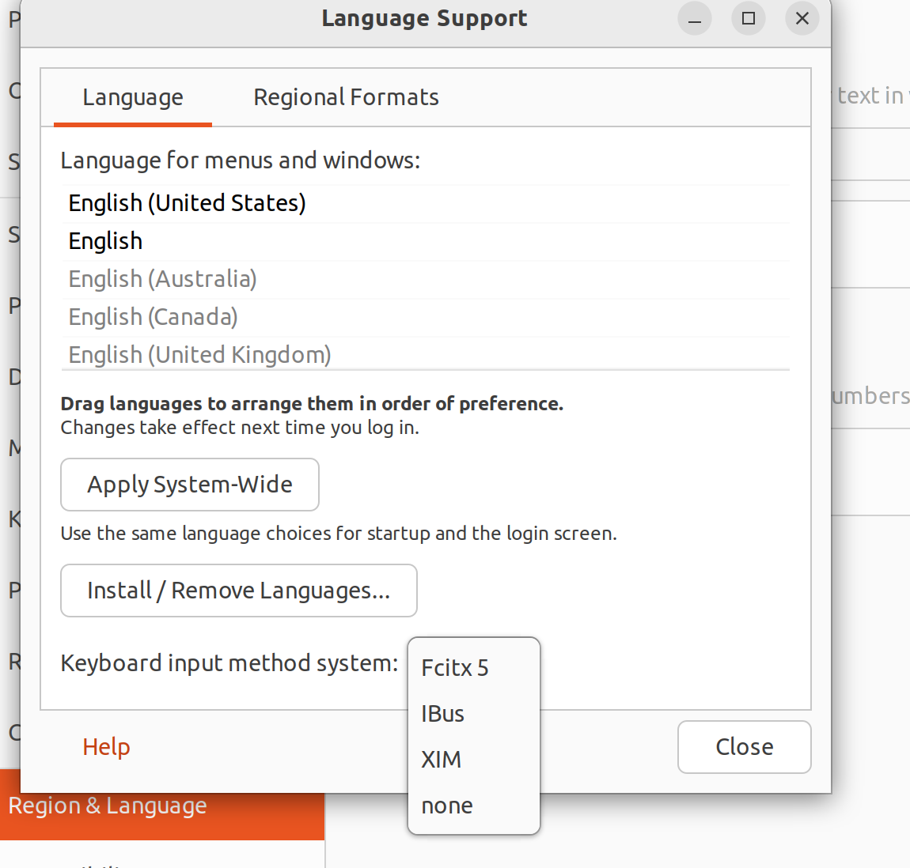
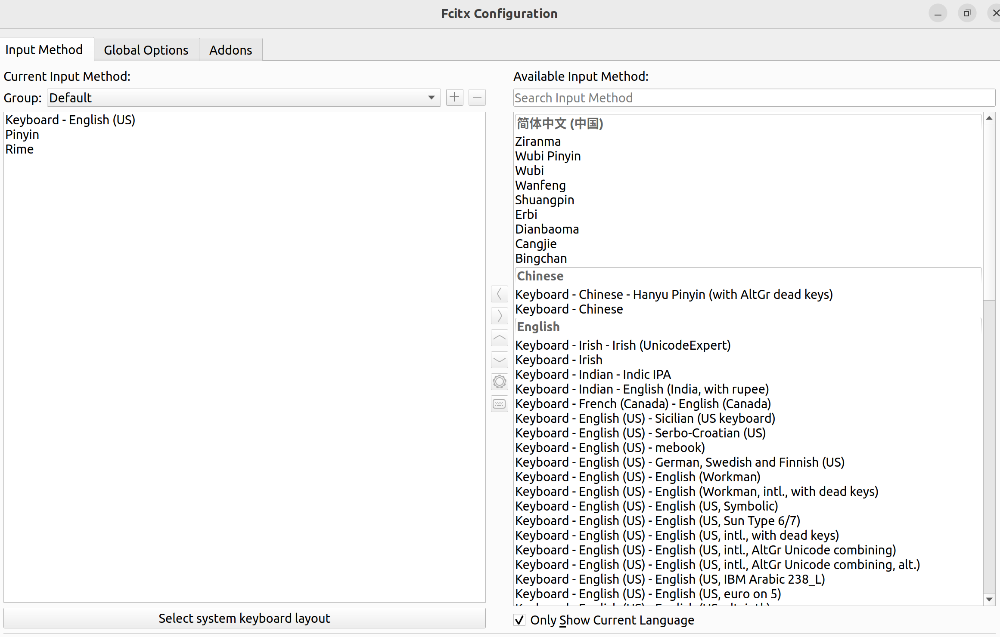

## 浅谈输入法

### 前置知识

输入法包括：
- **输入法框架**，即ibus、fcitx、fcitx5之类的.
    <br>
    上面这一大类在系统中叫做<strong>keyboard input method system</strong>，如下图所示.

    

    <br>
- **输入法引擎**，即fcitx5下的pinyin、rime之类的.
    <br>
    这一类就真的是<strong>input method</strong>,如下图所示.

    

    上图为fcitx5框架下的input-method-config界面.

- **词库**

### 查看系统的中文字体

```shell
fc-list :lang=zh
```

也可以排序查看

```shell
fc-list :lang=zh | sort
```
