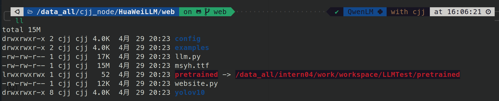
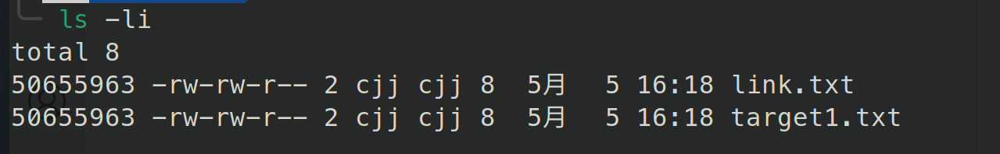
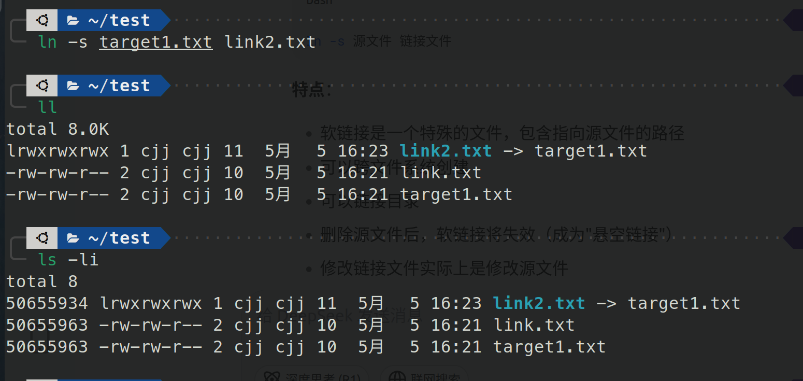
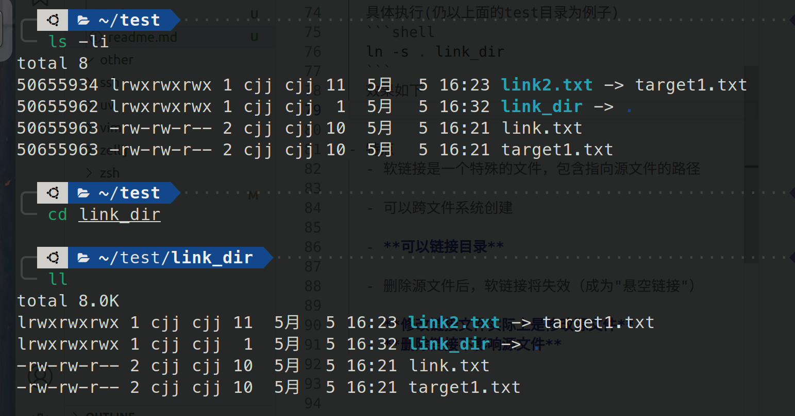
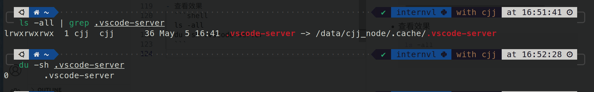
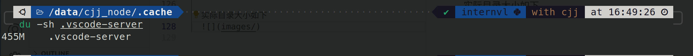

## 文件链接工具——ln

### 背景

有时想在维持当前工程源码的中路径不随着工程目录位置的改变而更改，那么就可以使用链接，如下



将pretrained指向了原模型文件，但是又可以以当前目录下的pretrained访问，给了一种**模型文件在当前工程目录下的**"假象"

### 使用

#### 硬链接使用
- 链接文件
    ```shell
    # link_file不能事先存在
    ln target_file link_file
    ```
    ```shell
    # 查看inode号，硬链接和源文件相同
    ls -li
    ```
    假设当前目录下存在一个target1.txt文件，内容如下
    ```txt
    123
    456
    ```
    执行以下指令
    ```shell
    ln target1.txt link.txt
    ls -li
    ```
    如下效果
    

- 查看所有指向同一inode号的硬链接
  ```shell
  find / -inum <inode号> 2>/dev/null
  ```
  具体效果如下
  
- 特点
    - 硬链接与源文件共享相同的inode和数据块

    - **删除源文件后，硬链接仍然可以访问数据**

    - 不能跨文件系统创建

    - 不能链接目录

    - **修改任一链接或源文件，所有链接都会同步变化**
  
#### 软链接（符号链接）使用

硬链接有个致命的不足——不能链接目录，故有了软链接.

- 链接文件
  ```shell
  # -s表示symbol,即符号链接
  ln -s target_file link_file
  ```
  以硬链接的文件夹下的测试为例，执行下面的指令
  ```shell
  ln -s target1.txt link2.txt
  ls -li  
  ```
  效果如下
  

- 链接目录
  ```shell
  ln -s /path/to/source/directory mydir_link
  ```
  具体执行(仍以上面的test目录为例子)
  ```shell
  ln -s . link_dir
  ```
  效果如下
  

  注意事项：
  - 链接显示红色：表示指向的源目录不存在
  - 尽量使用绝对路径，避免指向不存在的目录
  - "Too many levels of symbolic links"：可能有循环链接
  - 到达目录位置后不要再加/
    ```shell
    ln -s /path/to/dir/ link_name  # 错误，dir/会被当作文件
    ln -s /path/to/dir link_name   # 正确
    ```

- 特点
  - 软链接是一个特殊的文件，包含指向源文件的路径

  - 可以跨文件系统创建

  - **可以链接目录**

  - 删除源文件后，软链接将失效（成为"悬空链接"）

  - **修改链接文件实际上是修改源文件**
  - **删除链接不影响源文件**

### 我的常用场景——服务器.vscode-server软链接

为什么要这样操作，因为通常情况下$HOME目录的磁盘空间不是data盘，容易不足，而.vscode-server远程插件又是一个很吃内存的目录，在手动设置.vscode-server存储路径无法满足需求的情况下，直接使用链接是一个不错的选择.

操作如下

- 在data盘中创建对应目录
  ```shell
  mkdir .vscode-server
  ```

- 在$HOME目录下创建链接文件
  ```shell
  ln -s /data/...../.vscode-server ~/.vscode-server
  ```

- 查看效果
  ```shell
  ls -all # 查看链接关系
  du -sh .vscode-server # 查看链接目录是否占磁盘空间
  ```
  链接目录大小为0
  

  实际目录大小如下
  

  成功了！

### 后记

不足与代补充处欢迎提issue！
