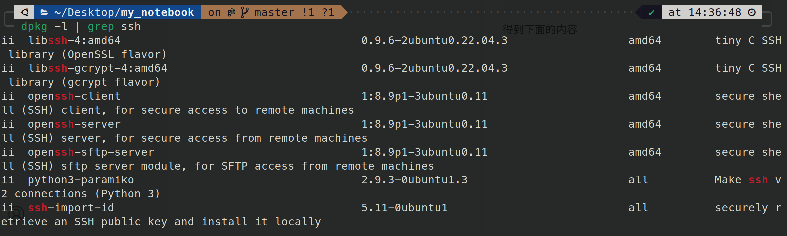
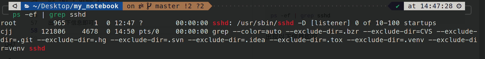
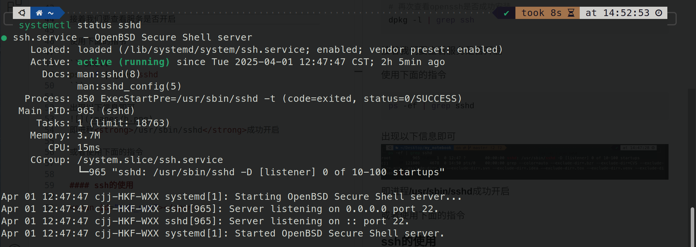
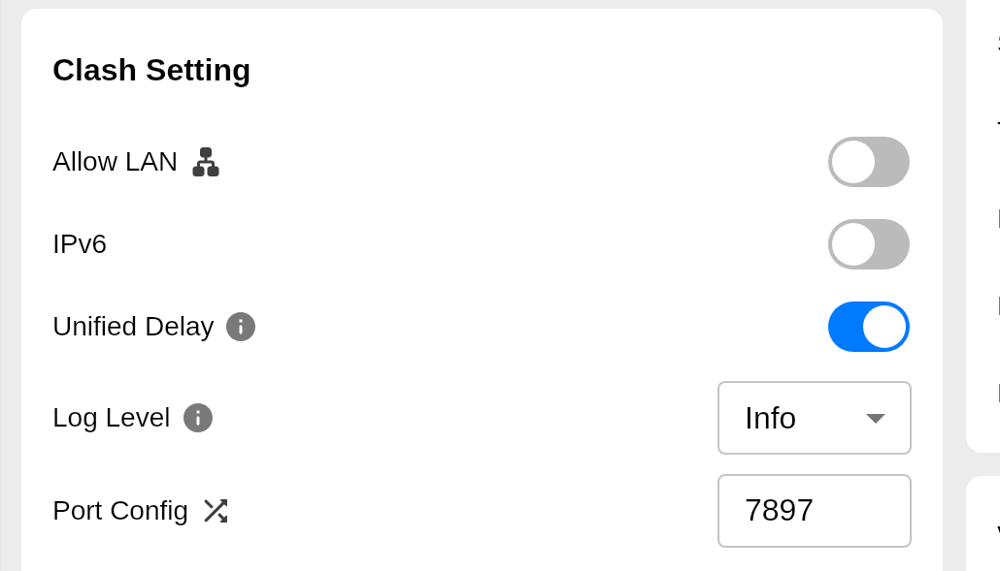
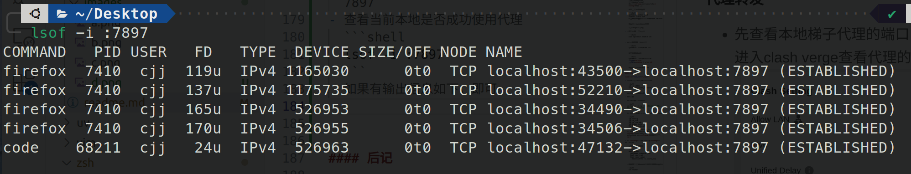
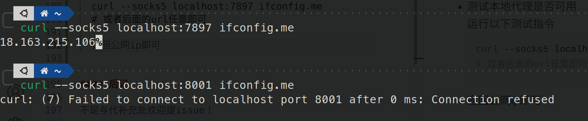
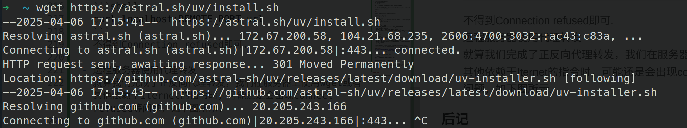
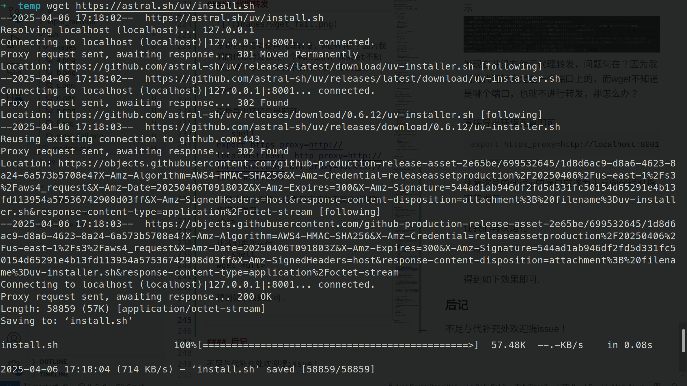

# ssh : 远程连接、服务器搭建必备

## 目录

[背景](#背景)  
[ssh安装与启动](#openssh安装与启动)  
[ssh的基本使用](#ssh的基本使用)  
[ssh转发代理](#ssh转发代理)  
[ssh可视化界面转发](#ssh可视化)  
[ssh用户环境隔离](#ssh用户环境隔离)   

<br>

## 背景

要想使用ssh,需要先查看我们的系统是否有ssh服务了(通常情况是指开源的openssh软件包)  

通过下面指令查找

```shell
dpkg -l | grep ssh
```

得到下面的内容


如果openssh-client与openssh-server即可跳到[使用阶段](#ssh_use)，否则继续下面的[安装过程](#ssh_install).

<br>

## openssh安装与启动

openssh官网 : https://www.openssh.com/

通常来说，有openssh-client即可远程连接服务器，但是要有openssh-server才能让本机成为服务器.

- 直接执行下面指令
  
  ```shell
  # 先更新软件包
  sudo apt update
  ```
  
  ```shell
  # openssh的安装
  sudo apt-get install openssh-client
  sudo apt-get install openssh-server
  ```
  
  ```shell
  # 再次查看openssh是否成功安装
  dpkg -l | grep ssh
  ```

- 检查服务是否开启.
  
    使用下面的指令
  
  ```shell
  ps -ef | grep sshd
  ```
  
    出现以下信息即可
    
    即进程<strong>/usr/sbin/sshd</strong>成功开启.
  
    或者使用下面的指令
  
  ```shell
  systemctl status sshd 
  stemctl status ssh
  # 上面两条指令等价，都查看ssh.service
  ```
  
    得到类型以下的信息即可
  
    

- 为服务设置开启自启动
  
  ```shell
  sudo systemctl enable ssh
  ```

- 查看是否成功开机自启动
  
  ```shell
  systemctl is-enabled ssh
  ```
  
  或者下面的指令
  
  ```shell
  systemctl list-unit-files --type=service    --state=enabled | grep ssh 
  ```
  
  得到结果显示enable即可.
<br>

## ssh的基本使用

- 已知服务器ip及用户，直接连接
  
  ```shell
  ssh -p <端口> username@<server_computer_ip> 
  ```
  
  提示输入密码即可连接.  

- 免密连接
  
  先本地产生公钥、私钥.
  
  ```shell
  ssh-keygen -t rsa   #-t表示类型选项，这里采用rsa加密算法
  ```
  
  我们会在本地的 ~/.ssh下看到如下文件目录
  
  ```shell
  ├── config
  ├── id_rsa
  ├── id_rsa.pub
  ├── known_hosts
  └── known_hosts.old
  ```
  
  其中，id_rsa即私钥、id_rsa.pub即公钥，我们将id_rsa.pub复制到服务器上的<strong>/home/user/.ssh/authorized_keys</strong>即可免密登陆.

  或者直接在客户端执行下面的命令
  ```shell
  ssh-copy-id <user>@<server_ip>
  # 或者 ssh-copy-id <Simple_Host>
  # 提示再次输入密码即可
  ```
  
  <br/>

- 通过<strong>~/.ssh/config</strong>文件简易登陆
  
    该文件的内容如下
  
  ```shell
  Host <name>
      HostName <computer_ip>
      Port <port_id>
      User <user_name>
      IdentityFile ~/.ssh/id_rsa
  ```
  
  配置了服务器的信息后，即可直接如下指令连接
  
  ```shell
  ssh <name>
  ```

<br>

## ssh转发代理

### 使用背景

当服务器上没有梯子的时候，我们客户端（即本地端）有梯子的时候，而我们又可以通过ssh远程连接服务器时，我们就可以通过转发代理来让远程服务器用上梯子.

### 查看端口

想要转发梯子服务，我们必然要查看客户端与服务端的端口信息，可以通过以下方式查看

```shell
netstat -tnp | grep ssh
# 如何提示no command，执行一下sudo apt-get install net-tools
```

或者

```shell
ss -tnp | grep ssh
```

输出信息如下

```
# State       Recv-Q  Send-Q   Local Address:Port      Peer Address:Port  Process
 ESTAB      0      0       192.168.2.41:58782   192.168.37.4:22    users:(("ssh",pid=86463,fd=3))
```

ip冒号后面的即端口，状态为estab即为建立状态.

### 监听端口

直接使用nc指令即可

```shell
nc -lk <端口号>
```

### 代理转发

- 先查看本地梯子代理的端口
  进入clash verge查看代理的端口，如下
  
  Port Config为7897,故该梯子代理的端口为7897

- 查看当前本地代理是否正常运行
  
  ```shell
  lsof -i :7897
  ```
  
  如果有输出信息如下，即可
  

- 测试本地代理是否可用
  运行以下测试指令
  
  ```shell
  curl --socks5 localhost:7897 ifconfig.me
  ```
  
  返回公网ip即可(如果是其他url不得到Connection refused即可).
  
  <br>
  下面是代理端口与非代理端口的效果
  
  

- 进行代理转发
  主要有两种方式，一种是正向代理，一种是反向代理(这两种方式的原理与区别暂时未理解).
  
  - 正向代理
    
    ```shell
    ssh -N -L 0.0.0.0:REMOTE_PORT:localhost:LOCAL_PROXY_PORT user@remote-server
    # -N 为不执行远程命令，仅用于端口转发
    # -L 将本地机(客户机)的某个端口转发到远端指定机器的指定端口
    ```
  
  - 反向代理
    
    ```shell
    ssh -R REMOTE_PORT:localhost:LOCAL_PROXY_PORT user@remote-server
    # -N 为不执行远程命令，仅用于端口转发
    # -R 为将远程主机(服务器)的某个端口转发到本地端指定机器的指定端口
    ```
    
    上面两种代理转发方式均可使远程服务器上的应用可通过 <strong>localhost:REMOTE_PORT</strong>使用你的本地代理.<br>
    **注意：上面的REMOTE_PORT不对应ssh连接ip的连接端口(即通过ssh -p port 指定的那个或者默认的)，应该是未被占用的端口.**

- 从远程服务器测试代理转发
  
  ```shell
    curl localhost:REMOTE_PORT <url>
  ```
  
    不得到Connection refused即可.

- 远程服务器使用代理转发
  就算我们完成了正反向代理转发，我们在服务器上使用wget或者其他依赖于Iternet的指令时，可能还是会出现connect refused等问题，如下图所示.
  
  
  
  发现它并没有使用代理转发，问题何在？因为我们的代理转发是在一个端口上的，而wget不知道是哪个端口，也就不进行转发，那怎么办？  
  
  <br>
  
  直接导出环境变量即可
  
  ```shell
  export https_proxy=http://localhost:8001  http_proxy=http://localhost:8001 all_proxy=socks5://localhost:8001
  ```
  
    注意这里的代理ip的端口应该为正反向代理时指定的端口.
  
  <br>
  
    让我们再次运行
  
  ```shell
  wget <url>
  ```
  
    得到如下效果即可.
  
    
  
    发现在wget前有一段话
  
  ```txt
  Resolving localhost (localhost)... 127.0.0.1
  Connecting to localhost (localhost)|127.0.0.1|:8001... connected.
  Proxy request sent, awaiting response... 301 Moved Permanently
  ```
  
    即**Proxy request sent**，即代理请求成功发送.

### http代理与sock5代理的应用范围

| **需求场景**                     | **推荐代理类型** |
|----------------------------------|------------------|
| 仅需Web浏览                      | HTTP代理         |
| 需要代理整个操作系统/所有应用    | SOCKS5代理       |
| 使用UDP应用（视频通话/在线游戏） | SOCKS5代理       |
| 需要内容过滤或缓存               | HTTP代理         |
| 代理非HTTP协议（如FTP）          | SOCKS5代理       |

可见，sock5的范围比http代理广，sock5可以代理整个需要用流量的操作，包括http代理.

<br>

## ssh可视化

### 背景

当需要服务器传回服务器上的图片或者可视化程序的输出，如ROS2的rviz2，opencv的imshow等，需要执行可视化操作.

- 服务器设置配置

  ```shell
  sudo vim /etc/ssh/ssh_config # 或者sshd_config，或者两个都修改
  ```

  打开并修改注释内容
  ```shell
  ForwardX11 yes
  ForwardX11Trusted yes
  PasswordAuthentication yes
  ```

- 连接

  ```shell
  ssh -X user@ip
  ```

参考文章： https://blog.csdn.net/Rosenls/article/details/130210686

## ssh用户环境隔离

### 使用背景

一般用于资源紧缺的GPU集群，多个人共用一个服务器用户时，需要环境隔离.

### 教程

- 本地~/.ssh/config修改
  ```vim
  Host <name>
    HostName <server_ip>
    User <user_name>
    Port <port>
    RemoteCommand /home/ma-user/work/<username>/init.sh
    RequestTTY yes
  ```

- 远程服务器上的配置
  在需要隔离的"用户目录"创建配置文件，以/data/x00525162/cjj_node为例
  ```shell
  cd /data/x00525162/cjj_node # 其中x00525162为共享用户
  vim init.sh
  ```

  写入
  ```shell
  export HOME=/data/x00525162/cjj_node
  exec bash # 关键一步
  #exec zsh
  ```
  
  接着把原~/.bashrc复制
  ```shell
  cp ~/.bashrc /data/x00525162/cjj_node
  ```

  更新环境，实现隔离
  ```shell
  cd /data/x00525162/cjj_node
  source init.sh
  ```


## 后记

不足与代补充处欢迎提issue！
