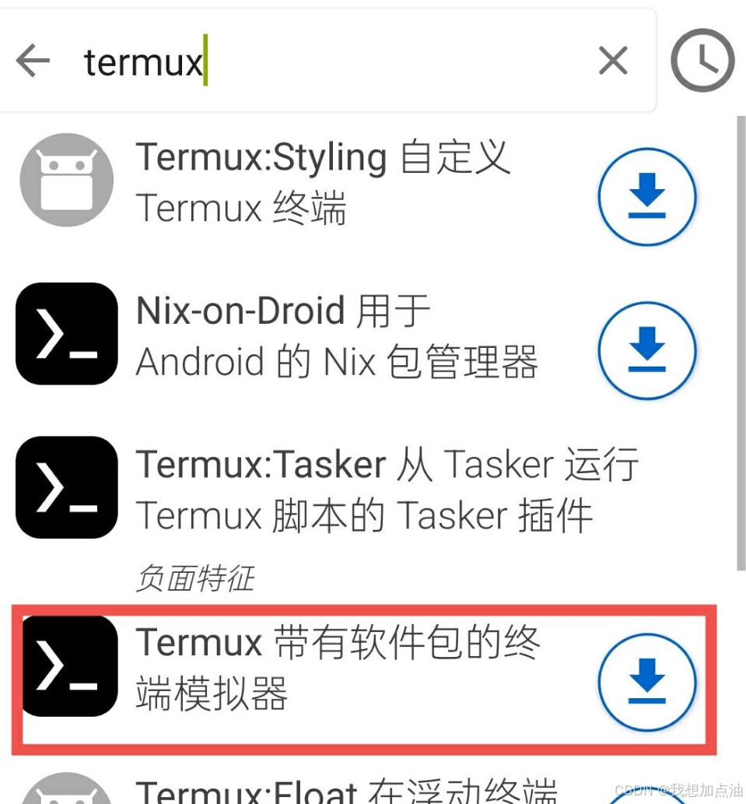
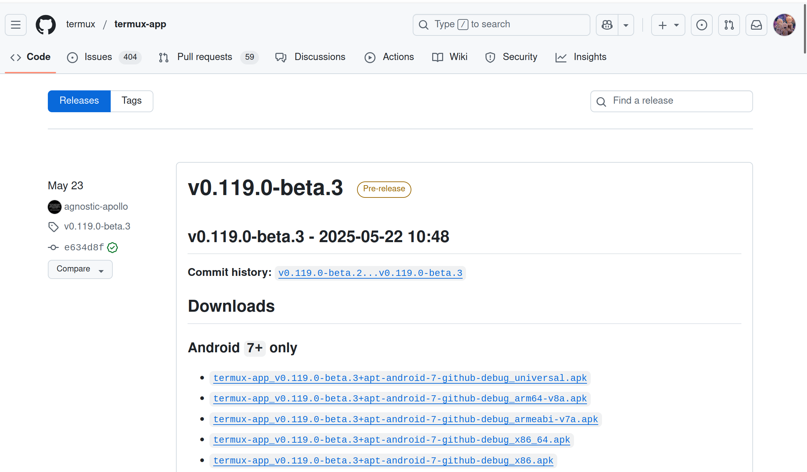

# Termux使用

## 目录
[背景](#背景)  
[安装](#termux安装)  

## 背景

看到安卓系统是基于Linux系统开发的，于是想着对安卓进行命令行界面操作，而现代安卓出于安全性考虑，通常没有root，那么开源的Termux无疑是个很好的选择.

Termux官网： https://github.com/termux/termux-app

## Termux安装

Termux的安装有多种方法，下面推荐两种.

- 通过F-Droid安装
通过官网先安装[F-Droid](https://f-droid.org/en/packages/com.termux/)，这是一个apk，即安卓软件，然后在在这个软件上搜索Termux来安装，如下



- 通过Termux官网的release安卓对应版本.


## Termux简单使用

由于其他需求不是很多，仅仅使用python的http.server包传输文件，故不做过多介绍.

首先在手机打开termux

- 运行访问当前手机的其他文件
  ```shell
  termux-setup-storage
  ```
  这时候会在当前termux的目录下生成一个链接到**storage**的同名目录，即手机的内部存储.

- 下载python
  ```shell
  apt install python
  ```

- 开启http.server
  ```shell
  python -m http.server 8001
  ```

- 查看ip
  ```shell
  ifconfig
  ```

注意，Linux要与安卓在同一局域网内才能访问.

## 参考文章

使用： https://www.ruanyifeng.com/blog/2019/07/termux-tutorial.html

使用： https://blog.csdn.net/qq_40280673/article/details/137352319?utm_medium=distribute.pc_relevant.none-task-blog-2~default~baidujs_baidulandingword~default-0-137352319-blog-144454472.235^v43^pc_blog_bottom_relevance_base5&spm=1001.2101.3001.4242.1&utm_relevant_index=3

安装：https://blog.csdn.net/weixin_51228185/article/details/144454472