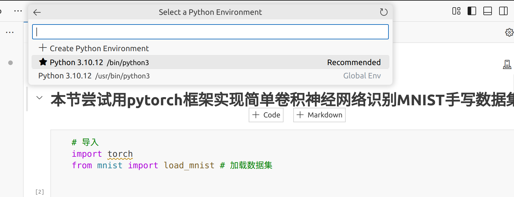
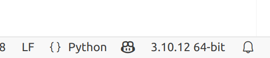
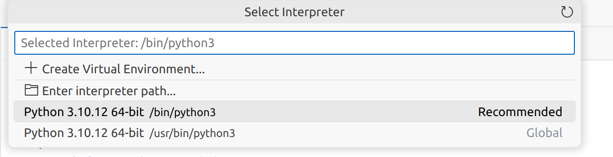
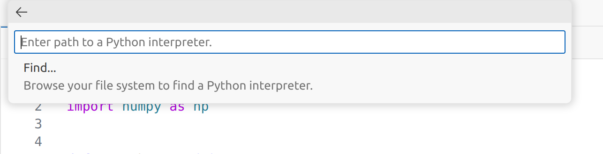

# uv : 轻量化的python包管理器

uv官方网址：https://docs.astral.sh/uv/

## 下载

以下2条指令均可

```shell
curl -LsSf https://astral.sh/uv/install.sh | sh
```

```shell
wget -qO- https://astral.sh/uv/install.sh | sh
```

安装完成后会在<strong> ~/.bashrc 或 ~/.zshrc</strong>下加入以下内容
```shell
. "$HOME/.local/bin/env"
```

即可输入uv使用

## uv使用

**以下是我个人的常用用法，仅供参考**

```shell
cd
mkdir -p uv_env/d2l
cd uv_env/d2l
uv init
```

得到文件结构

```txt
├── main.py
├── pyproject.toml
├── .python-version
└── README.md

```

进入pyproject.toml文件，复制以下内容即可

```toml
[project]
name = "d2l_env"
version = "0.1.0"
description = "Add your description here"
readme = "README.md"
requires-python = ">=3.9"
dependencies = [
    "d2l>=1.0.3",
    "opencv-python>=4.8.1.78",
    "torch>=2.6.0",
    "torchvision>=0.21.0",
]

[tool.uv.sources] # 指定特定的包的源
torch = [{ index = "pytorch-index" }]
torchvision = [{ index = "pytorch-index" }]

[[tool.uv.index]]
url = "https://mirrors.tuna.tsinghua.edu.cn/pypi/web/simple"
default = true

[[tool.uv.index]]
name = "pytorch-index"
url = "https://download.pytorch.org/whl/cpu"
explicit = true
```

**.python-version 里是当前uv环境的python版本**

接下来便是python包的安装了

```shell
# 从url源安装
uv add <package_name>

# 从本地文件安装
uv add <本地python包.whl>

# 指定其他源安装
uv add torch --index pytorch=https://download.pytorch.org/whl/cpu # 就会在pyproject.toml文件产生对应的source与index

# 通过requirements.txt安装包
uv add -r requirements.txt
```

### uv的环境在vscode的jupyter中无法找到

<strong>我要的uv环境：/home/cjj/uv_env/d2l/.venv/bin/python3</strong>

问题如下：


找不到想要的uv环境.

**原因分析**

.venv是虚拟环境，且是隐藏文件，jupyter插件当然找不到.

**解决方案**：

- 一、在当前目录下create 一个新的uv环境，只有在当前目录下的.venv隐藏文件，jupyter与vscode的python解释器(interpreter)才能找到.但是这样显然不是我们uv的理想使用目标.
- 二、先在当前目录下设置python解释器即可.如下图所示.
  
  点击，然后
  
  
  找到路径即可.

  **然后就可以在.py和.ipynb使用指定的uv环境了!**


### 其他

- uv init会采用默认的python版本，可以通过下面命令转化
    ```shell
    uv python pin <py_version> # 转化python版本
    uv python list # 查看不同版本的安装情况
    ```

- 要产生虚拟环境，先要执行以下指令
    ```shell
    uv run python # 如果没有当前python版本，则会自动安装
    ```
    那么当前目录下就生成了<strong>.venv</strong>目录

- 以当前的环境执行py文件
    ```shell
    # 法一 : uv 直接执行
    uv run <.py>

    # 法二 : 为当前终端激活环境
    source .venv/bin/activate
    pyhton <.py>
    ```

## 补充内容

参考wzx学长的ICT笔记

https://www.notion.so/ICT-COMP-NOTES-1b3b46473910805c9ea6d29c605bbb50?pvs=4

**防止丢失https://www.notion.so/ICT-COMP-NOTES-1de8323c2e1d8050aabdf46ca63be401**

