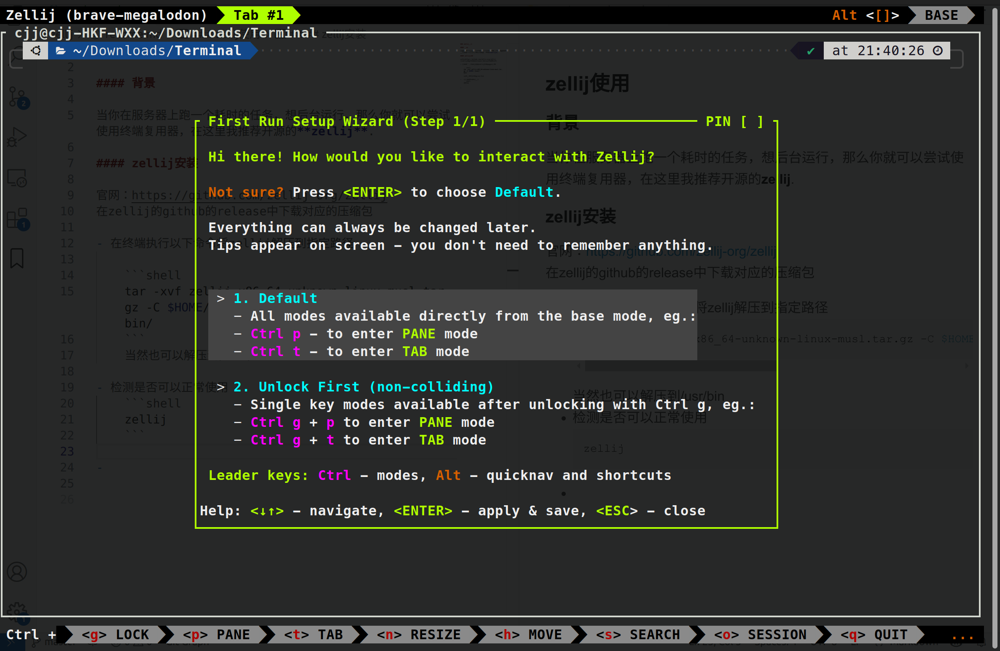

### zellij使用

#### 背景

当你在服务器上跑一个耗时的任务，想后台运行，那么你就可以尝试使用终端复用器，在这里我推荐开源的**zellij**.

#### zellij安装

官网：https://github.com/zellij-org/zellij  
在zellij的github的release中下载对应的压缩包

- 在终端执行以下命令将zellij解压到指定路径

    ```shell
    tar -xvf zellij-x86_64-unknown-linux-musl.tar.gz -C $HOME/.local/bin/                                          
    ```
    当然也可以解压到/usr/bin

- 检测是否可以正常使用
    ```shell
    zellij
    ```
    出现下面界面即可
    

    如果提示zellij: Command not found

    执行下面指令添加环境变量
    ```
    export PATH=$PATH:<Your zellij path>
    ```
    或者把上面的指令写入~/.bashrc或者~/.zshrc里面

#### zellij使用

具体的使用进入zellij界面有，下面是我目前常用的指令

- 进入zellij后，执行想要的后台程序，ctrl + o(即创建会话)，然后d即可后台运行，但是这时候的会话名字是随机的，要注意
- 查看会话
  ```shell
  zellij ls
  # zellij list-sessions
  ```

- 创建会话
  ```shell
  zellij -s <session_name>
  # zellij --session <session_name>
  ```

- 删除会话
  ```shell
  zellij k <session_name>
  # zellij kill-session <session_name>
  ```

