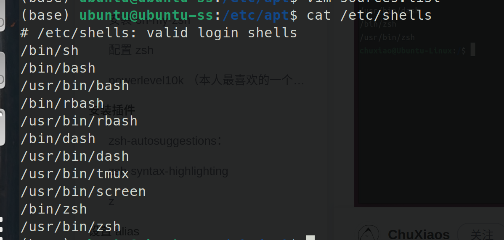
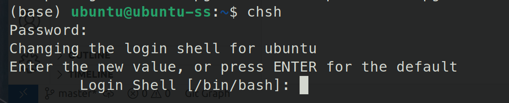
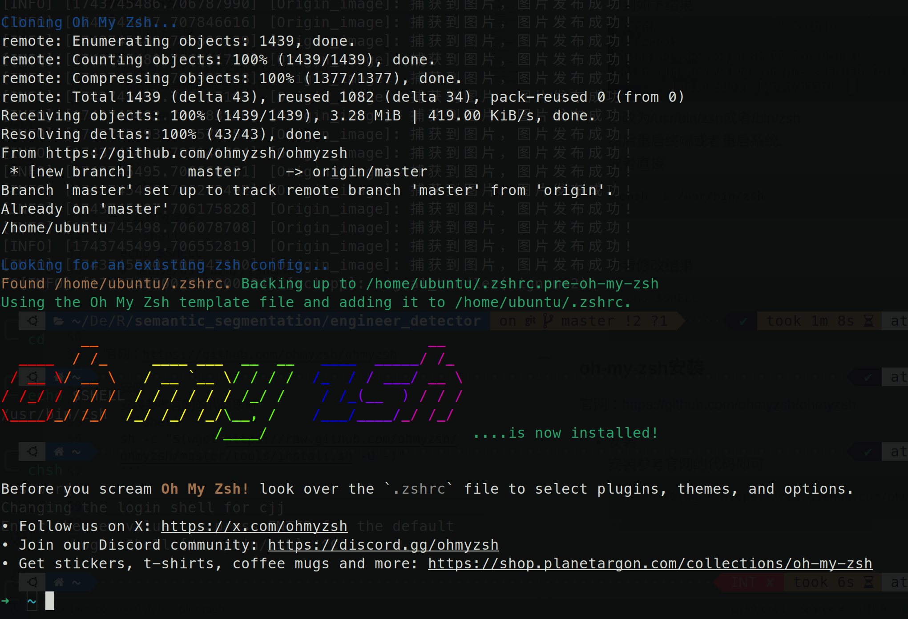

## zsh配置

### 背景

还在用不可拓展的bash吗?不如尝试高度可定制化的zsh吧!

什么？你说你不知道什么是zsh!

zsh、bash等是一种命令行解释器(shell)，一句话就是解析命令行指令的.(注意不要和终端的概念搞混了，terminal是一种输入输出环境).

### zsh安装

- 先安装zsh本体
  
  ```shell
  sudo apt-get install zsh
  ```

  也可以直接下载二进制可执行文件：https://github.com/cuijunjie18/my_notebook/releases/tag/zsh-v0.1
  
    输入命令查看当前安装的shell
  
  ```shell
  cat /etc/shells
  ```
  
    得到如下，存在/bin/zsh或者/usr/bin/zsh即可
  
    
  
  <br>

- 设置zsh为默认shell
  
  ```shell
  chsh
  ```
  
  得到如下结果
  
  修改为/usr/bin/zsh或者/bin/zsh
  然后重启终端或者重启系统.
  
  或者直接
  
  ```shell
  chsh -s /usr/bin/zsh
  ```
  
  <br>

- 查看修改结果
  
  ```shell
  echo $SHELL
  # 输出为/usr/bin//zsh即可
  ```

### oh-my-zsh安装

官网：https://github.com/ohmyzsh/ohmyzsh

- 安装
  安装参考官网的代码即可
  
  ```shell
  sh -c "$(wget https://raw.github.com/ohmyzsh/ohmyzsh/master/tools/install.sh -O -)"
  ```
  
  出现下面的界面即为安装成功
  

- 配置主题
  在~/.oh-my-zsh中有以下内容
  
  ```txt
  ├── cache
  ├── CODE_OF_CONDUCT.md
  ├── CONTRIBUTING.md
  ├── custom
  ├── lib
  ├── LICENSE.txt
  ├── log
  ├── oh-my-zsh.sh
  ├── plugins
  ├── README.md
  ├── SECURITY.md
  ├── templates
  ├── themes
  └── tools
  ```
  
  其中的themes与plugins为oh-my-zsh的主题与插件，cusstom中的为附加的支持oh-my-zsh调用的主题与插件.  
  我们在~/.zshrc里可以进行选择.

### p10k主题安装

在安装了oh-my-zsh后，我们会发现内置的主题过于单一或者没有自己喜欢的，这里我推荐一个主题powerlevel10k，简称p10k.

官网：https://github.com/romkatv/powerlevel10k

- 安装p10k
  
  ```shell
  # 直接执行官网的安装教程
  git clone --depth=1 https://github.com/romkatv/powerlevel10k.git "${ZSH_CUSTOM:-$HOME/.oh-my-zsh/custom}/themes/powerlevel10k"
  
  # 无梯子可以gitee
  git clone --depth=1 https://gitee.com/romkatv/powerlevel10k.git "${ZSH_CUSTOM:-$HOME/.oh-my-zsh/custom}/themes/powerlevel10k"
  ```

- 安装p10k官方字体
  官网：https://github.com/romkatv/powerlevel10k.git
  
  ```shell
  wget https://github.com/romkatv/powerlevel10k-media/raw/master/MesloLGS%20NF%20Regular.ttf
  wget https://github.com/romkatv/powerlevel10k-media/raw/master/MesloLGS%20NF%20Bold.ttf
  wget https://github.com/romkatv/powerlevel10k-media/raw/master/MesloLGS%20NF%20Italic.ttf
  wget https://github.com/romkatv/powerlevel10k-media/raw/master/MesloLGS%20NF%20Bold%20Italic.ttf
  ```

- 推荐Nerd-font：更多选择
  官网：https://github.com/ryanoasis/nerd-fonts#font-installation
  
  直接在release中找到安装包下载解压即可.

- p10k主题使用
  在.zshrc中加入以下内容
  
  ```vim
  ZSH_THEME="powerlevel10k/powerlevel10k"
  ```
  
  然后source ~/.zshrc即可

- p10k的重新配置
  
  ```shell
  p10k configure
  ```
  
  即可重新配置.

### 拓展插件安装

虽然.oh-my-zsh中有内置的插件，但是肯定满足不了我们的需求，于是我们要安装拓展插件.

把插件下载到本地的 ~/.oh-my-zsh/custom/plugins 目录.

下面介绍3个我用的插件

- zsh-autosuggestions
  自动命令补全
  
  ```shell
  git clone https://github.com/zsh-users/zsh-autosuggestions ${ZSH_CUSTOM:-~/.oh-my-zsh/custom}/plugins/zsh-autosuggestions
  ```

- zsh-syntax-highlighting
  语法校验
  
  ```shell
  git clone https://github.com/zsh-users/zsh-syntax-highlighting.git ${ZSH_CUSTOM:-~/.oh-my-zsh/custom}/plugins/zsh-syntax-highlighting 
  ```

- z
  文件夹快捷跳转
  
  ```shell
  # 无需安装，oh-my-zsh中内置的
  ```
  
  使用的话，直接在~/.zshrc中加入以下代码即可

```vim
plugins=(
    git
    zsh-autosuggestions
    zsh-syntax-highlighting
    z
)
```

### 易出问题的地方

- **切换zsh后环境缺失**
  Linux初学者可能不太熟悉.bashrc与.zshrc等配置文件的工作方式，导致将zsh设置为默认shell后之前在bash中的环境配置没有继承到zsh中，那么有以下两种解决方法.
  
  - 1、将~/.bashrc中的环境设置指令复制到~/.zshrc中，同时注意如果出现其他errors或者warning信息，需要仔细检查环境设置中是否存在**source env_name/setup.bash**之类的指令，改为setup.zsh即可(如果存在).
  
  - 2、这是一种不太规范的方式，在~/.bashrc最后加上一句指令
    
    ```shell
    exec zsh
    ```
    
  即可在bashrc中继承环境变量，不过此时的默认shell要是bash，只是通过~/.bashrc切换到zsh而已，且运行bash指令无法回到bash.需谨慎使用.

### 便捷使用

一键安装指令(适用于有一定基础的用户)
```shell
sudo apt-get install zsh -y
sh -c "$(wget https://raw.github.com/ohmyzsh/ohmyzsh/master/tools/install.sh -O -)" -y
git clone --depth=1 https://github.com/romkatv/powerlevel10k.git "${ZSH_CUSTOM:-$HOME/.oh-my-zsh/custom}/themes/powerlevel10k"
git clone https://github.com/zsh-users/zsh-autosuggestions ${ZSH_CUSTOM:-~/.oh-my-zsh/custom}/plugins/zsh-autosuggestions
git clone https://github.com/zsh-users/zsh-syntax-highlighting.git ${ZSH_CUSTOM:-~/.oh-my-zsh/custom}/plugins/zsh-syntax-highlighting 
```

### 后续

有错误的地方或需要补充的地方，欢迎提issue.


